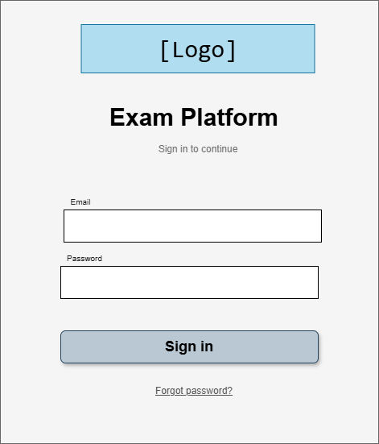
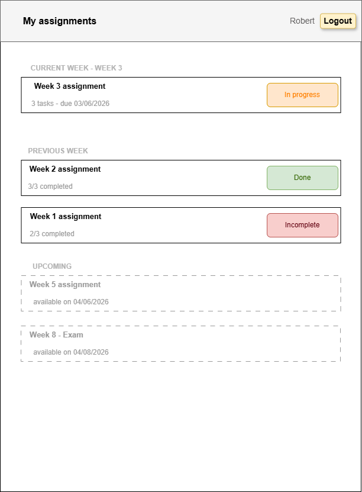
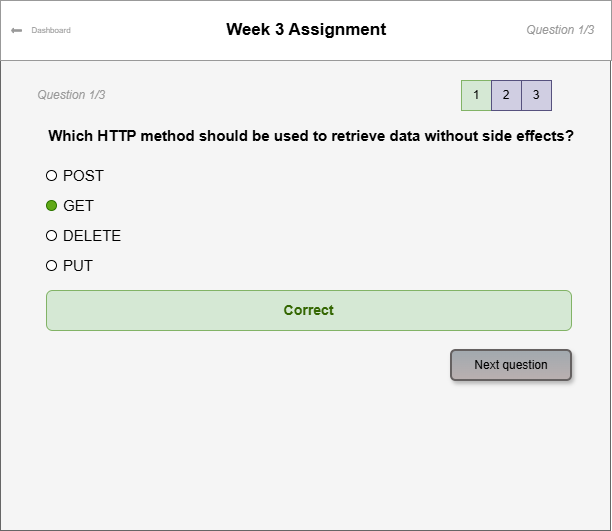
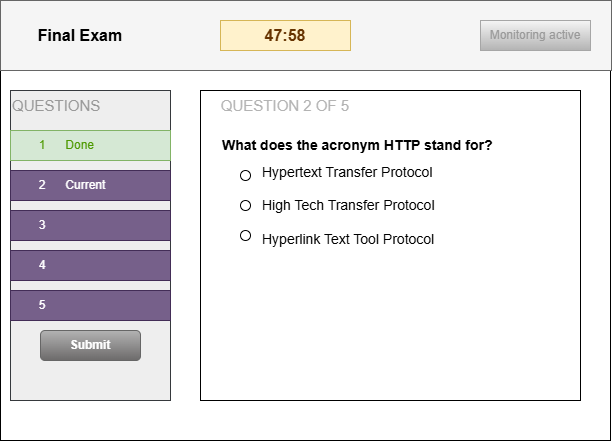

# AI Exam Platform

Oulu University of Applied Sciences (OAMK) Summer project (2026).
Web-based platform for weekly programming assignments and supervised online exams,
with AI-assisted monitoring during exams.

## Status
Phase 1 - research and setup.

## Documentation
- [Git practices](GIT_PRACTICES.md)
- [Project plan](PROJECT_PLAN.md)
- [Architecture](ARCHITECTURE.md)
- Research notes in `docs/research/`

## How to run

**Requirements:** [Docker Desktop](https://www.docker.com/products/docker-desktop/)

1. Copy `.env.example` to `.env`:
   ```bash
   cp .env.example .env
   ```
2. Start the stack:
   ```bash
   docker compose up --build
   ```
3. Open `http://localhost:3000` in your browser

| Service  | URL                          |
|----------|------------------------------|
| Frontend | http://localhost:3000        |
| Backend  | http://localhost:4000        |
| Database | localhost:5432               |

**Stop:** `docker compose down`
**Next time:** `docker compose up` (no `--build` needed unless Dockerfiles or dependencies changed)
**Wipe database:** `docker compose down -v`

## Wireframes


**Login**





**Student dashboard**





**Assignment view**





**Assignment view**




