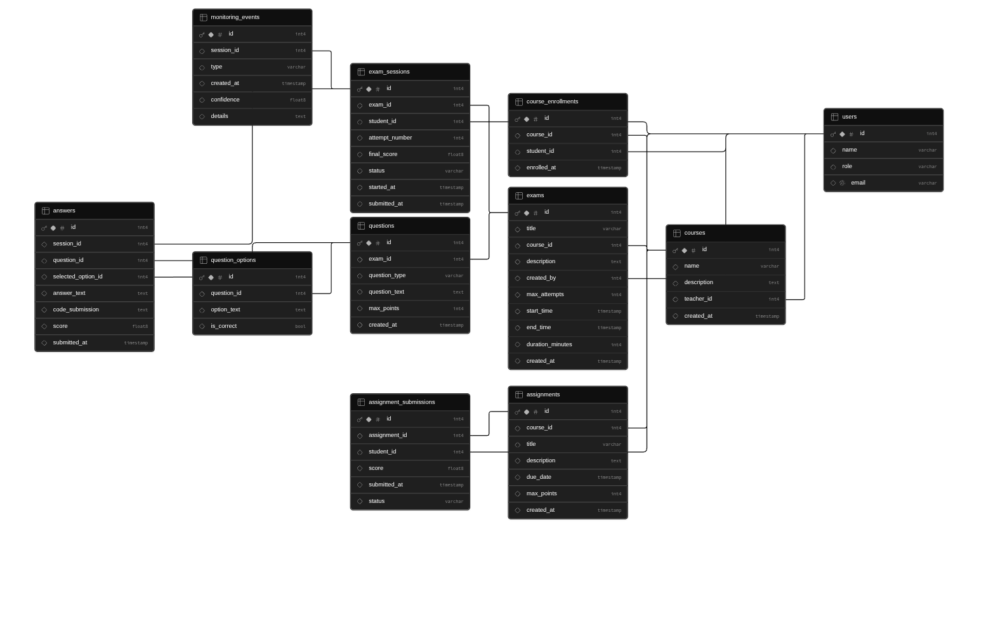

# Database documentation

## Overview

Project uses Supabase as the primary database platform.

## Database Schema 

Database model version: 1.0

## **Explanation of table groups:**

### ***User management***

### User    
Stores all system users.

Roles: 

- Administrator
- Teacher
- Student

### course_enrollment  
Links students to courses.

------

### Course Management

### courses
Stores course information.

### assignments
Stores assignments belonging to a course.

### assignment_submissions
Stores student assignment submissions and grading results.

-----

### Exam System

### exams
Stores exam definitons and settings.

### questions
Stores questions belonging to exams.

### question_options
Stores answer options for multi-choice questions.

### answers
Stores submitted answers during exam sessions.

### exam_sessions
Stores individual student exam attemps.

-----

### Monitoring

### monitoring_events
Stores suspicious events during session

Examples:
- Tab switch
- Looking away from screen for X amount of time

---

# **Supabase Setup**

## Enviroment variables

Create:
    frontend/.env

Copy / paste the following information to .env from Supabase:

VITE_SUPABASE_URL=< project-url >     
VITE_SUPABASE_PUBLISABLE_KEY=< key >

## Client location

frontend/src/utils/supabase.js

------

# Notes

- Tables require policies before frontend can read or modify data.
- If not set, data will not be shown.

## Common issues 

### Query returns empty array

Possible cause:
- Row Level Security (RLS) is enabled

### Solution:

Table needs an appropriate SELECT policy for the table.