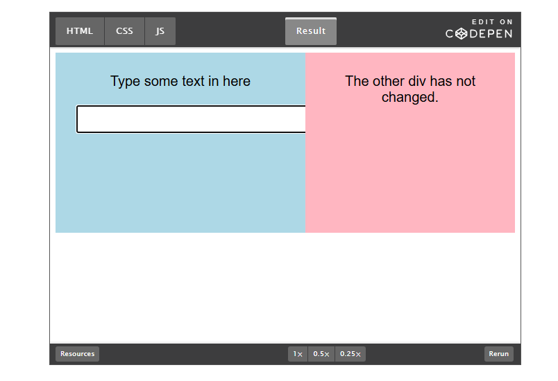
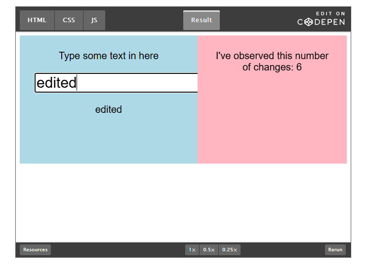

# Research on browser extensions 

## Possibilities to detect if user is using browser extensions 

Chrome extension detection is possible on website applications when webpage sends specific URL requests that are using the extensions ID and attempt to access these extensions resources that are exposed for the internet and these resources are known as web- acessible resources. Web application can be used to fingerprint browser at lest google chrome and see what extensions the browser has in use. This only works with google extensions so if user uses another web browser it wont work.   

# Javasrcipt DOM tree surveilance

JavaScript can be used to observe DOM tree changes in web pages html structures and many ai assistants like google translate changes the text instantly and manipulates html structure so that if used it can be detected. 
Ai agents such as Claude agent that could be used to modify code in coding tasks can be detected by using DOM monitoring because the agent injects its footprint to html structure. 

This works on our project becouse customer wanted to know that is it possible to see what plugins are in use during exam and is it possible to get information about plugins being used during exam. With DOM observer (MutationObserver) we can detect in any browser if Ai assistants are being used during exam and we can detect exact time with timestamps when they have been active. 

It is still a fact  that we cant surely tell which extensions are installed on users machine. 

## Possible disconnection

There is also possibility that cheater can prevent the user data to be sent to applications database by closing the window or browser. Common asynchronoys requests axios or fetch will often abort on sudden change of screen or closing it. 

Suggested solution is to use sendBeacon() method for sending small payloads of data to applications server to prevent issues and ensure that usage data is sent to server even when user closes the exam page suddenly or navigates to a different page.          

## Mutation observer in practice

DOM observing in preactice can detect any changes in html structure in this demo there is a web page where user can directly edit text and observer captures if anything changes.

This image has initial state for html manipulation.

This image shows that observer can detect changes to html sturcture.

## links:

https://browserleaks.com/chrome#web-accessible-resources-detection

https://www.javascripttutorial.net/javascript-dom/javascript-mutationobserver/

https://cheq.ai/blog/the-cyborg-session-reversing-detecting-claude-ai-agent-chrome-extension/

https://medium.com/@marktnoonan/use-mutationobserver-to-fix-flaky-dom-updates-66e159eeb10c

https://developer.mozilla.org/en-US/docs/Web/API/Navigator/sendBeacon

