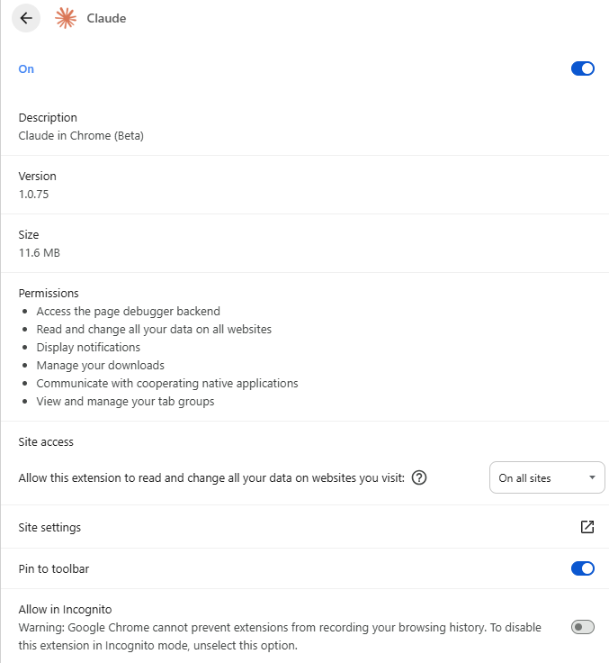

# Incognito / Private Mode and Browser Extensions

**Date:** 10.6.2026

**Why:** The customer asked about incognito mode and browser plugins (extensions). The worry is that during an exam a student could use a browser extension to cheat, and that incognito mode might change how extensions behave. This doc writes down what we found so we can make a decision and explain it to the customer.

People often say "plugins" but in modern browsers these are really called **extensions** (small add-on programs like ad blockers, Grammarly, AI assistants, etc.).

---

## Methodology

This was a documentation-based research. We:

1. Read the official browser documentation for Chrome, Edge, Firefox, and Safari on how extensions behave in private/incognito mode.
2. Cross-checked Chrome, Edge and Firefox default behavior and how a user changes it, so we were not relying on a single source.
3. Looked specifically for version changes, since browser behavior changes over time (this turned out to matter for Safari - see below).

## Question 1 - Does incognito mode allow browser extensions?

In most cases: **no by default, but the user can turn them on.**

Chrome, Edge, and Firefox all disable extensions in private mode unless the user has explicitly allowed them per extension. Safari used to be the exception, but as of Safari 17 (2023) it now also disables the extensions that matter - any extension that can read or inject page content is off by default in Private Browsing. Content blockers (like ad blockers) that do not read page content stay on, because they are not a privacy or cheating risk.

The important thing: this is the **user's choice**, not something we can control. A student who wants to use an AI assistant in incognito can go into their extension settings and enable it there. It takes only a few seconds.

So incognito disabling extensions is a **privacy side effect**, not a security feature designed for exams. It was never built to stop cheating, and the student can undo it.

---

## Question 2 - If incognito allows extensions, can they be disabled (safe mode)?

This is how it actually works:

- Incognito **disables** extensions by default (the opposite of allowing them).
- A user can manually **turn an extension back on** for incognito by going into the browser settings and switching on "Allow in incognito" for that specific extension.

So extensions are off by default in incognito, and the user has to pro-actively turn each one on. There is no separate "safe mode" inside incognito.

The **student controls their own browser**, they can flip that "Allow in incognito" switch themselves. We cannot stop them from our web app. So incognito is not something we can rely on to keep extensions off, because the student can undo it.

As for safe mode - it disables all extensions - but it is not something we can enforce. We can ask students to use it but we cannot verify if they did.

---

## Question 3 - Do extensions affect the system if used during the test?

Extensions run inside the browser, not on the whole operating system, so they do not have full access to the computer the way an installed program does. They can affect the exam page, which is what matters for us.

Things an extension could realistically do during an exam:

- Read or change the content of the exam page (this is normal extension behavior)
- Auto-fill answers or run an AI assistant on the question text
- Copy the questions out to somewhere else
- Block or interfere with our monitoring scripts

So the risk is not "the extension damages the system." The risk is "the extension helps the student cheat or interferes with our page." That is the part the customer should care about.

From a normal web page, **we cannot see what extensions a student has installed.** The browser does not expose that to websites (for privacy reasons). So we cannot detect or block extensions from our side.

---

## Question 4 - Browser-specific differences

All four major browsers do the same basic thing (extensions off by default in private mode, user can turn them back on). The naming and steps differ.

| Browser | Name for private mode | Default for extensions | How user re-enables |
|---------|----------------------|------------------------|---------------------|
| Chrome | Incognito | Disabled | Extensions page -> Details -> "Allow in incognito" |
| Edge | InPrivate | Disabled | Extensions -> Manage extension -> "Allow in InPrivate" |
| Firefox | Private Window | Disabled | Add-ons -> Manage -> "Run in Private Windows" -> Allow |
| Safari | Private Window | Disabled / limited | Safari settings, per extension |

So there is no browser where extensions stay on in private mode without the user doing something. But equally, there is no browser where the user is prevented from turning them back on.

---

## Question 5 - Browser safe mode

We also looked at whether a browser "safe mode" helps. Most browsers have a troubleshooting or safe mode that starts with extensions turned off (Firefox calls it Troubleshoot Mode, others have similar). It is meant for fixing browser problems, not for exams.

It does not help us for the same reason as everything above: the student starts it themselves and can leave it at any time. We cannot force a student's browser into safe mode from our web app, and we cannot check whether they are in it.

Some differences between browsers:

**Firefox** - the most straightforward. Help -> Restart with Add-ons Disabled (Troubleshoot Mode). All extensions off, browser restarts in a limited mode. The student can see they are in it.

**Chrome / Edge** - no built-in safe mode button. They can be launched with a `--disable-extensions` command-line flag, or by creating a fresh profile with no extensions. Not user-friendly - students would need step-by-step instructions.

**Safari** - no real safe mode. Extensions have to be disabled manually, one by one.

---

## Risks and limitations

- Incognito mode does not reliably disable extensions - the user can re-enable them in a few clicks.
- We have no way to detect whether a student is using incognito mode.
- We have no way to detect whether extensions are active.
- Asking students to use safe mode relies on trust - the same as asking them not to cheat.
- Browser behavior changes between versions, so any assumption we make could go stale. We should not hard-code assumptions about a specific browser's behavior.
- Even if extensions are fully disabled, a student can still use a second device, photograph the screen, or use other workarounds outside the browser entirely (which should be preventable by gaze tracking).

---

## Conclusion and recommendation

Incognito mode, safe mode, and "disabling plugins" are **not things our web solution can control or rely on.** They are all controlled by the student's own browser, and we cannot see or change them from a web page.

What we can do:

- Focus on the monitoring we will be building (tab switching, focus loss, visible warnings, event logging for the teacher).
- Be honest with the customer that extension-based cheating cannot be fully prevented in a normal browser. The only way to truly block extensions is a lockdown browser like SEB, which has its own trade-offs (see the SEB spike `docs/research/safe-browser.md`).

---

## Browser versions used for research

- **Chrome** version 149.0.7827.55
- **Firefox** version 143.0b1
- **Edge** version 149.0.4022.52

---

## References

- Chrome - extensions in incognito (Allow in Incognito toggle): https://support.google.com/chrome/answer/95464
- Firefox - extensions in private browsing: https://support.mozilla.org/en-US/kb/extensions-private-browsing
- Edge - manage extensions in InPrivate: https://support.microsoft.com/en-us/microsoft-edge/add-turn-off-or-remove-extensions-in-microsoft-edge-9c0ec68c-2fbc-2f2c-9ff0-bdc76f46b026
- Safari - use extensions and "Allow in Private Browsing" (Safari 17+ behavior): https://support.apple.com/en-us/102343
- Related internal doc: `docs/research/safe-browser.md`
